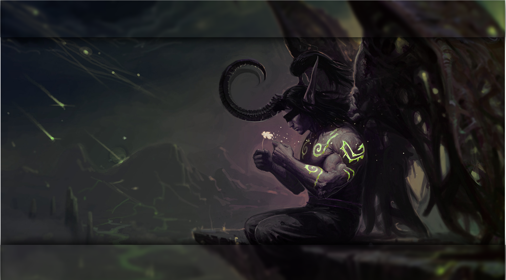

# Illidan GRUB2 theme



# Installation

* Download repository 
* Copy **illidan** folder to **/boot/grub/themes/**
* Edit **/etc/default/grub** and add: **GRUB_THEME="/boot/grub/themes/illidan/theme.txt"**

* Update grub :

```bash
$ sudo update-grub

```